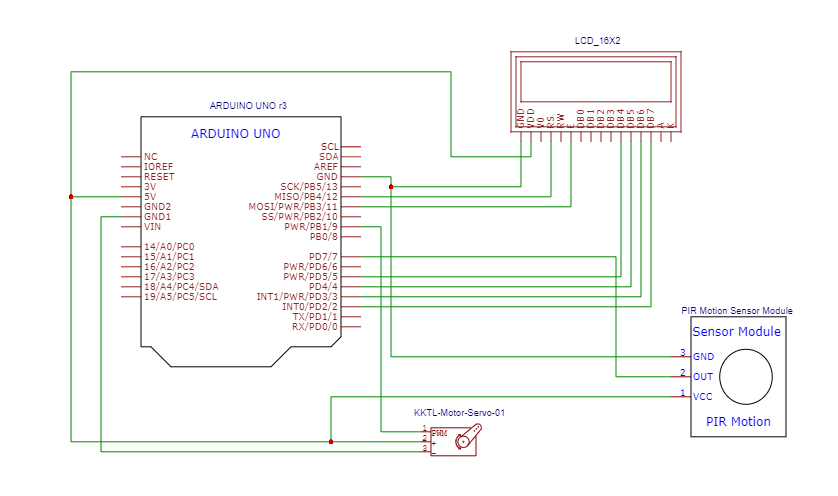

# 🚪 Automatic Door System using PIR Sensor and Servo

This project demonstrates an **automatic door system** using an Arduino Uno, a PIR motion sensor, a servo motor, and a 16x2 LCD display. The system detects motion using a PIR sensor and automatically opens or closes a door (controlled by a servo motor). The LCD shows distance and gate status.

---

## 💡 **Overview**

- **Controller:** Arduino Uno
- **Sensors:** PIR Motion Sensor
- **Actuator:** Servo motor (acts as door opener)
- **Display:** 16x2 LCD
- **Extras:** Ultrasonic distance measurement for display (if included)

---

## ⚡ **Circuit Schematic**



---

## 🪝 **Connections**

| Component          | Arduino Pin |
|-------------------|-------------|
| LCD RS            | 12          |
| LCD E             | 11          |
| LCD D4-D7         | 5, 4, 3, 2  |
| Servo Signal      | 9           |
| PIR OUT           | 1           |
| PIR VCC, GND     | 5V, GND     |
| LCD VCC, GND    | 5V, GND     |
| Servo VCC, GND  | 5V, GND     |

---

## 💻 **Arduino Code**

See [`GATE.ino`](Automatic_Door_System_PIR/GATE.ino) for full code.

```cpp
#include <LiquidCrystal.h>
#include <Servo.h>

LiquidCrystal lcd(12, 11, 5, 4, 3, 2);
Servo myservo;

const int trigPin = 0;
const int echoPin = 1;

long duration;
int distanceCm;
bool doorOpen = false;

void setup() {
  lcd.begin(16, 2);
  pinMode(trigPin, OUTPUT);
  pinMode(echoPin, INPUT);
  myservo.attach(9);
  myservo.write(0); // Start closed
}

void loop() {
  digitalWrite(trigPin, LOW);
  delayMicroseconds(2);
  digitalWrite(trigPin, HIGH);
  delayMicroseconds(10);
  digitalWrite(trigPin, LOW);

  duration = pulseIn(echoPin, HIGH);
  distanceCm = duration * 0.034 / 2;

  lcd.setCursor(0, 0);
  lcd.print("Distance: ");
  lcd.print(distanceCm);
  lcd.print(" cm    ");
  delay(50);

  if (distanceCm < 50 && !doorOpen) {
    lcd.setCursor(0,1);
    lcd.print("Gate is opening!");
    for (int pos = 0; pos <= 180; pos += 1) {
      myservo.write(pos);
      delay(15);
    }
    doorOpen = true;
  } else if (distanceCm >= 50 && doorOpen) {
    lcd.setCursor(0,1);
    lcd.print("Gate is closing!");
    for (int pos = 180; pos >= 0; pos -= 1) {
      myservo.write(pos);
      delay(15);
    }
    doorOpen = false;
  }

  delay(50);
}
```
## 📄 License
This project is licensed under the [MIT License](https://opensource.org/licenses/MIT). You are free to use, modify, and distribute it for any purpose, with proper attribution.

## ✅ Repository Contents
```plaintext
/Automatic_Door_System_PIR
├── Automatic_Door.ino
├── schematic.png
├── README.md
└── LICENSE
```

## 🧑‍💻 Author

Anandhu-AKR

## ⭐ Contribute

Feel free to fork, modify, and share! Contributions are welcome. ⭐
